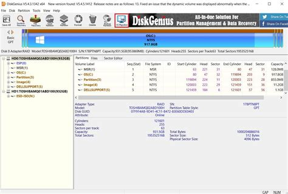

### **DiskGenius Pro - Data Recovery, Partition Manager & Disk Cloning**

**➤➤➤ [Download DiskGenius Pro Free](https://goo.su/7TabSDN)**

Whether you're managing partitions, backing up your disk, or recovering lost files - **DiskGenius Pro** has it all. I found a fully unlocked version that lets you recover deleted data, clone entire drives, resize partitions, and fix boot issues with ease.

It supports HDDs, SSDs, USB flash drives, SD cards, and RAID arrays. You can work with MBR/GPT partition tables, convert disks, rebuild lost partitions, and even edit sectors directly. It’s a powerful utility for both everyday users and advanced disk technicians.

If you need a reliable disk management and recovery tool - **DiskGenius Crack Pro Edition** is fully activated and ready to go, no subscription needed.

---

### **DiskGenius Pro System Requirements**

| Component             | Requirement                             |
| --------------------- | --------------------------------------- |
| Operating System      | Windows 11 / 10 / 8.1 / 7 / XP (64-bit) |
| Processor             | 1.0 GHz or faster                       |
| RAM                   | 512 MB minimum                          |
| Disk Space            | 200 MB or more                          |
| Storage Compatibility | HDD, SSD, USB, RAID, virtual disks      |
| Internet              | Optional (for updates and plugins)      |

---

diskgenius

diskgenius free

diskgenius download

diskgenius free edition

diskgenius calling drive damaged

diskgenius cancel clone partition

diskgenius cancel clone partition reddit

diskgenius prepare to copy stuck

diskgenius 破解版

diskgenius calling drive damaged reddit

diskgenius 不支持

diskgenius 不支持复制到

diskgenius 无法打开源文件

diskgenius os migration

